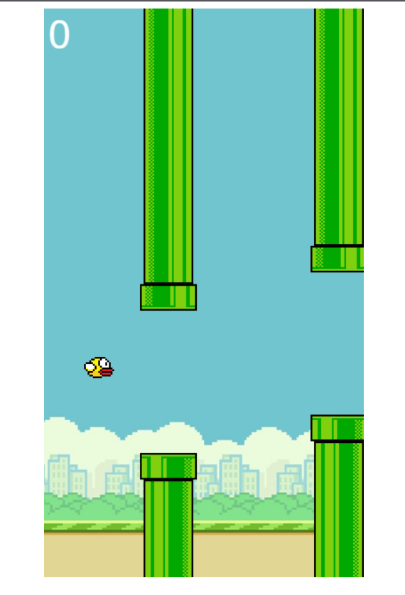
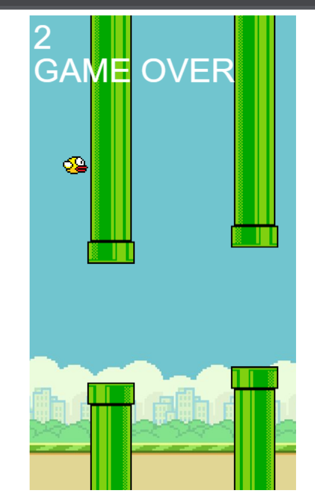

<h1 align="center" id="title">Bird Game</h1>

This Bird game is designed with HTML5 CSS and JavaScript. Using concepts of Web development it is a visually easy to use game I created for fun! You have to prevent the bird from falling by using your arrow keys depicting score at the top you can restart again if you lose. Enjoy ;)

<h2>Project Screenshots:</h2>

<h2>🛠️ Installation Steps:</h2>

1. Installation is easy either fork this project or download the files put them in a folder and run Index.html you'll be good to go !!

  
  
<h2>💻 Built with</h2>

Technologies used in the project:

*   HTML
*   CSS
*   JavaScript
